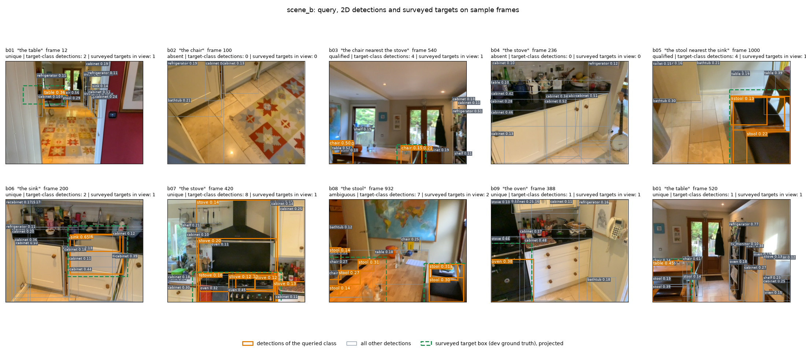

# Part 2 — Grounding Notes

**Time spent:**
6 Hours

**AI tools used:**
Claude Code

## Summary

Each query is answered from one frame only: take the best detection of the right class, lift it to 3D with the depth image and pose, and return that point. It works well when the object is detected and the geometry is right (scene_b: 78% hit rate). It has two big weaknesses. First, my confidence is basically the detector score, so it doesn't know when the geometry is off (scene_a's AUROC is 0.17, worse than chance). Second, there is no memory across frames, so "nearest the stove" is never actually checked: the stove was never found in the same frame as the object being asked about.



Orange boxes are detections of the queried class, grey boxes are everything else the detector found, and dashed green boxes are the surveyed target projected into the frame (dev ground truth). It's a good illustration of why this is hard: b03 and b05 are "qualified" queries where the reference class (stove, sink) isn't even detected, b02/b04 are genuinely absent, and b08 has several same-class boxes to choose between.

## Result (`uv run python score.py`, dev scenes)

| Scene | Answered | Median spread (m) | Hit rate | Goal recall | Confidence AUROC | Abstain rate on absent |
|-------|----------|-------------------|----------|-------------|------------------|------------------------|
| a | 20/27 | 0.59 | 0.40 | 0.38 | 0.17 | 1.00 |
| b | 18/27 | 1.45 | 0.78 | 0.67 | 0.86 | 1.00 |
| c (test) | 9/21 | 0.66 | – | – | – | – |
| d (test) | 23/30 | 1.31 | – | – | – | – |

Test scenes only get the label-free numbers, since we don't have their targets.

### Where I drew the line on answering, and why

The rule is simple: I answer whenever the target class is detected (score ≥ 0.15) and its box has usable depth (at least 10 valid pixels, 0.3–6 m away). Otherwise I return `null` with confidence 0.1. I don't skip frames just because they look hard, since that would only make hit rate look better while goal recall drops.

- **Absent frames:** all of them were `null`, because the detector found nothing of that class. That's right, but it's partly luck. The rule can't tell "absent" from "present but missed".
- **The cost:** a few visible targets got no detection and so became `null` (a04 f=825, b03 f=492, b05 f=8 and f=264). That's most of the gap in goal recall.

## How a detection becomes a 3D goal

1. **Clean up the detections:** drop scores below 0.15, run class-wise 2D NMS (IoU 0.5), and later merge same-class points closer than 0.3 m in 3D (this catches nested boxes on one object).
2. **Depth:** I treat depth pixel (u, v) as colour pixel (u, v), multiplied by `scale_m`. Warping with the recorded calibration made the RGB/depth alignment worse in scenes b and c, so I don't use it (calibration report, Issue 6). scene_a uses the re-paired depth and scene_c has its frozen frames zeroed (Issue 1 and 2), so those frames give `null`.
3. **Pick the surface:** in the central half of the box, take the 20th-percentile depth (the near surface, not the wall behind), and keep pixels within ±6 cm of it (ideas taken from score.py).
4. **To world:** back-project those pixels with the depth intrinsics, average them, and apply that frame's camera-to-world pose.

## How I pick among candidates

- **Plain query ("the oven"):** the highest-scoring detection of that class.
- **Qualified query ("the chair nearest the stove"):** find the best-scoring reference (the stove) in the same frame, then choose the target closest to it in 3D. If the reference isn't detected, I fall back to the best-scoring target and lower the confidence.
- **In practice the qualifier never fired.** In all four scenes the reference was never detected in a frame where a target was answered, so every qualified answer is really "best-scoring target".
- **No memory across frames.** With several valid instances (chairs, sinks), different views can pick different ones. That's why the spread is large in scenes b and d (1.3–1.4 m). The code has a landmark-clustering helper that would fix both problems, but it belongs to Part 3 and isn't used here.

## What my confidence measures

It's a rough score, not a calibrated probability. It starts from the detector's score for the chosen box. For qualified queries it's multiplied by 0.5 if the reference wasn't found, or by `0.5 + 0.5 × reference score` if it was (an extra ×0.7 if only one target was in view, since nothing could be compared). It's clipped to 0.02–0.98, and `null` gets 0.1.

So it means "how sure is the detector about this box". It doesn't know whether the point I computed sits on the right object. In scene_b that's good enough (AUROC 0.86). In scene_a it fails: the most confident answers were wrong.

## Where it fails

| Query | Frame | What happened | Why |
|-------|-------|---------------|-----|
| a08 refrigerator | 780, 850, 915 | Miss on all three, confidence 0.88–0.91 (the highest in the scene) | Detection is confident, but the goal sits about 1.0–1.2 m from the surveyed fridge. Across scene_a the goals are shifted by roughly (0.2, −0.1, −0.6) m from the boxes; removing that shift cuts the mean error from 0.81 to 0.48 m. scene_b has no such shift (0.62 → 0.58). |
| a07 oven | 785, 960 | Miss at confidence 0.83 and 0.63 | Same kind of shift; at 785 the goal is 0.39 m from a cabinet and 0.80 m from the oven. The oven and fridge are both detected strongly, so I can't separate label mix-ups from the shift. |
| a02 sink | 1015, 1025, 1210 | Miss on all three at 0.44–0.64 | The three sink boxes are small and flat (about 0.5 × 0.4 × 0.2 m), so a shift of this size misses them. |
| b03 chair nearest stove | 540 | Picked a chair 1.5 m from the right one | The stove wasn't detected, so "nearest" was ignored. At f=960 it's a hit only because just one chair was in view. |
| a04, b03, b05 | 825, 492, 8, 264 | `null` although the target is visible | No detection above the threshold; costs goal recall. |
| a05 fireplace | 60, 1240 | Miss, but confidence only 0.27–0.28 | The one place where confidence does its job: the detector itself was unsure. |

The scene_a shift is the main unresolved issue. It is constant across objects and viewpoints and doesn't grow with distance, so it looks like geometry (poses, calibration or how the survey is registered) and not the detector. I can't tell which with this data, which fits calibration report §3 (trajectory accuracy can't be verified). scene_c answers the fewest frames (9/21) and I haven't looked into why.

## With a labelling budget of 200 frames

I'd split it as follows:
- **~50 frames with objects' masks**. To calibrate our depth estimation method, which currently relies on bounding boxes and heuristics.
- **~150 frames with 2D bounding boxes**. For objects where the detector performs poorly (e.g. stools, chairs) and potentially fine-tune the detector.

## Reproducing

```bash
uv run python fetch.py
uv run python scripts/fix_scene_a_sync.py   # builds data/scene_a_fixed
uv run python scripts/fix_scene_c_sync.py   # builds data/scene_c_fixed
uv run python run_part2.py --eval           # writes answers.json, prints every (query, frame)
uv run python score.py
```
